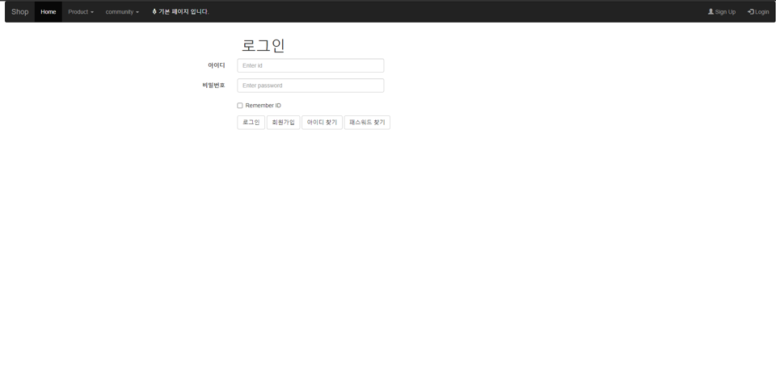
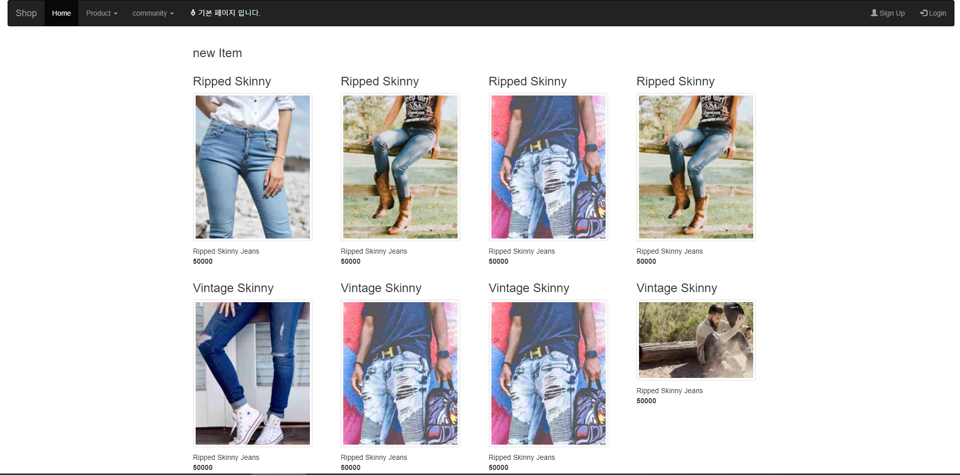
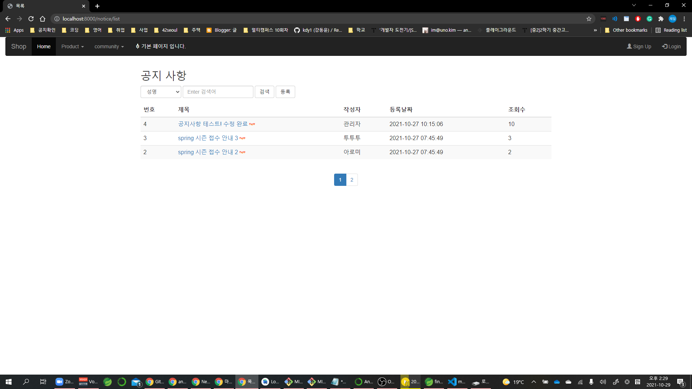
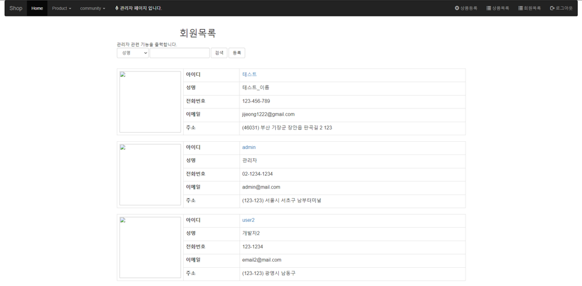

 # Shopping mall

 ## Stack
 <ul>
	<li>Language	: Java8 HTML CSS JavaScript</li>
	<li>Framework	: Springboot</li>
	<li>Library		: Mybatis</li>
	<li>Database	: Oracle DB</li>
	<li>Web Browser	: Chrome</li>
	<li>Environment	: Windows10 64bit</li>
	<li>IDE			: SpringToolSuite4</li>
 </ul>

 ## Goal & Acheivement
 <ol>
 	<li><del>Implementation for Login, User info management<del></li>
	<li><del>Separate user and admin by using privilege<del></li>
	<li><del>Implement notice page using list api<del></li>
	<li><del>Implement detail product information page<del></li>
	<li>Implement cart page</li>
	<li>Implement purchasing page</li>
	<li><del>Implement page for managing user information: for individual user & for admin which can access every user info<del></li>
	<li>Implement reply function by using ajax communication</li>
 </ol>

 ### Main page

 ### Login Page
 

 ### Product List Page
 

 ### Product Information Page
 

 ### Notice page
 

 ### User Info List
 
